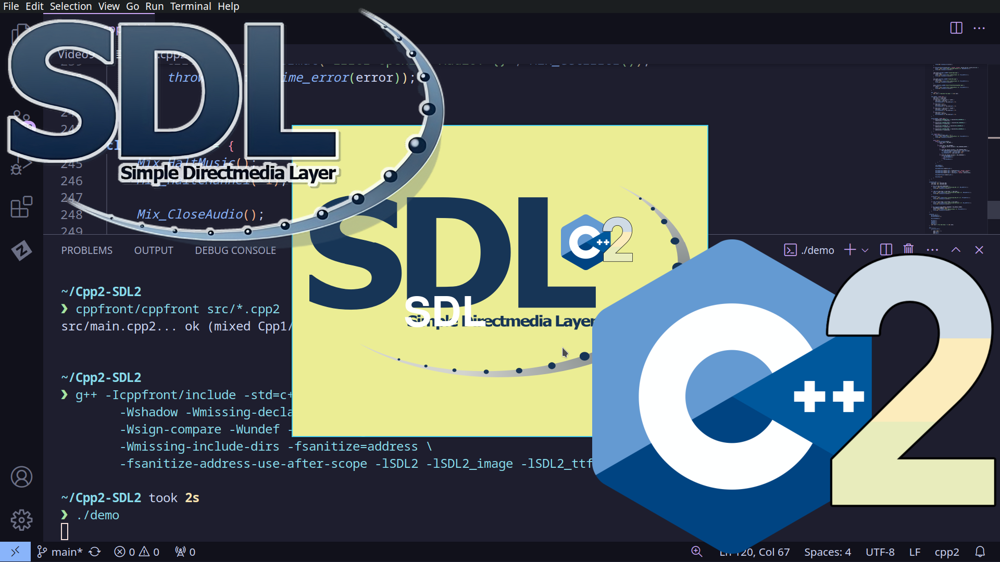

# Beginners Guide to SDL2 in Cpp2

An in-depth guide to getting started with SDL2 in Cpp2 C++ Syntax 2

This is SDL2 with Herb Sutters C++ Syntax 2 or Cpp2 using cppfront cross compiler.

cppfront github page: https://github.com/hsutter/cppfront \
cppfront documentation: https://hsutter.github.io/cppfront \
3rd Party cppfront documentation: https://github.com/ntrel/cpp2

CppCon 2022 cppfront presentation: https://www.youtube.com/watch?v=ELeZAKCN4tY \
CppNow 2023 cppfront presentation: https://www.youtube.com/watch?v=fJvPBHErF2U

